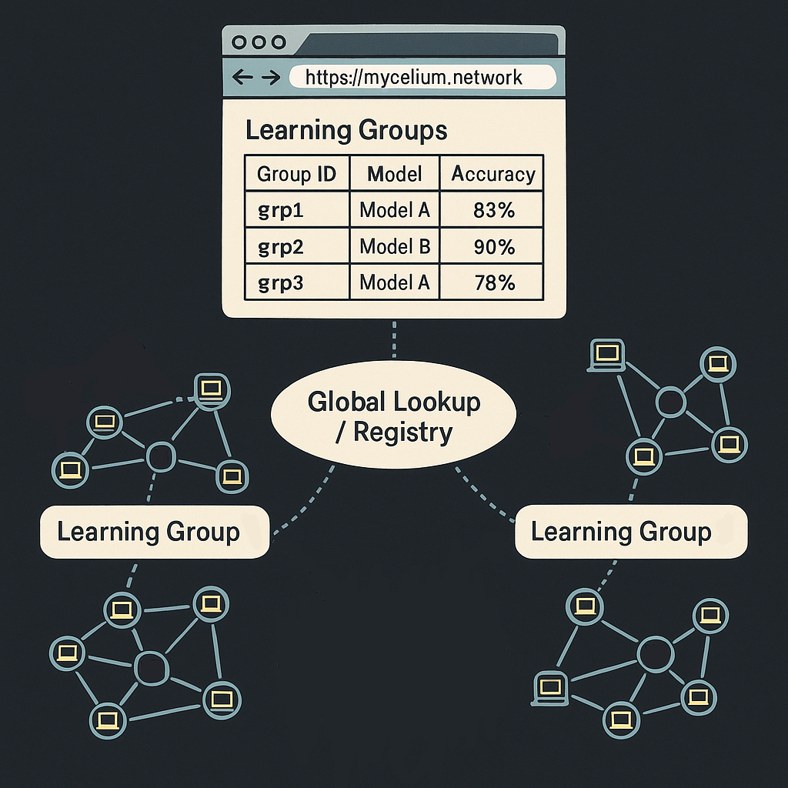
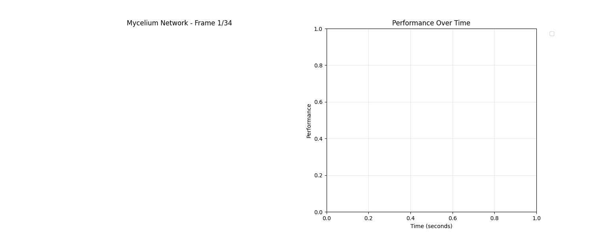

# Mycelium Net - Meta-Federated Learning Network

A prototype implementation of a "network of ML networks" - an internet-like protocol for federated learning where nodes can discover, join, and migrate between different learning groups based on performance metrics.



Here is a demo of the learning groups:



## Features

- **Dynamic Group Formation**: Nodes create and join learning groups automatically
- **Performance-Based Switching**: Nodes migrate to better-performing groups
- **Global Registry**: Centralized discovery service for groups and nodes
- **Real-time Visualization**: Network topology and performance tracking

## Quick Setup

1. **Install dependencies**:
```bash
pip install -r requirements.txt
```

2. **Run basic demo**:
```bash
python demo.py
```

3. **Run with visualization** (creates animated GIF):
```bash
python visualizer.py
```

## File Structure

- `registry.py` - Central registry server (FastAPI)
- `mycelium_node.py` - Individual network node with Flower client integration
- `flower_server.py` - Flower federated learning servers
- `demo.py` - Basic console demo with Flower integration
- `visualizer.py` - Advanced demo with animated visualization
- `requirements.txt` - Python dependencies (includes Flower AI & PyTorch)

## How It Works

1. **Registry Server** runs on `localhost:8000` and manages:
   - Learning group discovery
   - Node registration  
   - Performance tracking

2. **Flower Servers** run on ports `8081`, `8082`, etc., providing:
   - Federated learning coordination
   - Model parameter aggregation
   - Training round management

3. **Nodes** automatically:
   - Register with the registry
   - Connect to Flower servers for actual federated learning
   - Train PyTorch models with real gradient updates
   - Switch to better-performing groups based on model accuracy

4. **Visualization Mode** captures network state and generates:
   - Real-time network topology
   - Performance evolution over time
   - Animated GIF showing node migrations during actual FL training

## Demo Modes

### Basic Demo
```bash
python demo.py
```
- Console output showing group formations and switches
- 4 nodes with **real Flower federated learning**
- **PyTorch neural networks** training on synthetic data
- Multiple Flower servers for different groups
- Press Ctrl+C to stop

### Visual Demo
```bash
python visualizer.py
```
- Same as basic demo plus visualization
- Runs for 90 seconds collecting **real FL training data**
- Generates `mycelium_network.gif` showing node switching during training
- Opens matplotlib window with live animation

### Manual Components
```bash
# Start registry only
python registry.py

# Start individual Flower server
python flower_server.py group_1 8081

# Check API at http://localhost:8000/docs
```

## API Endpoints

- `GET /groups` - List all learning groups
- `POST /groups` - Create new group
- `POST /nodes/register` - Register node
- `POST /groups/join` - Join group
- `GET /network/state` - Get complete network state

## Customization

Edit node behavior in `mycelium_node.py`:
- `heartbeat_interval` - How often nodes evaluate group switches
- `performance_boost_rate` - Learning improvement rate
- Group capacity and performance thresholds

The system demonstrates emergent behavior where high-performing groups attract more nodes, while nodes continuously seek better learning opportunities.
